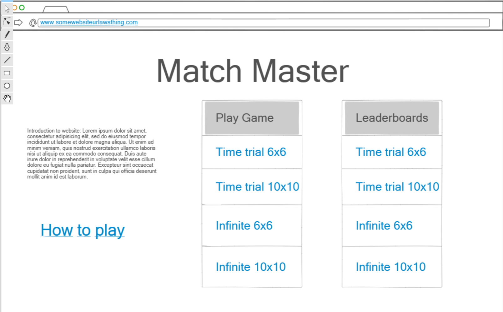
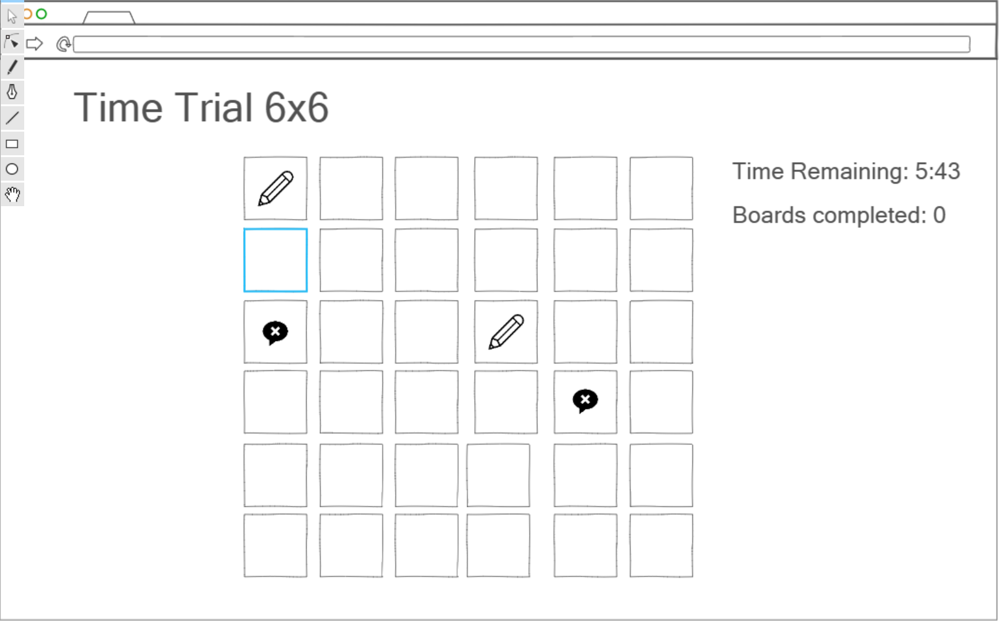
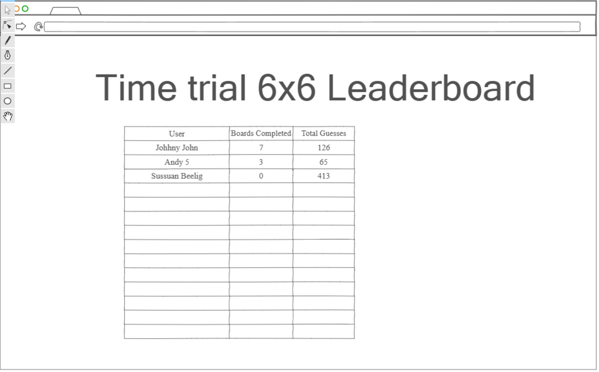

# Startup
Startup repo cs260 fall 2023

## Pitch
Match Master is a new online memory game that allows **anyone anywhere** to test their  abilities to their limit. Featuring different difficulty levels and game modes, there is a way for everyone to enjoy it. By keeping track of global high scores, Match Master allows players to track and compare their performance to others which will keep them coming back for more. 
## Features
  * Multiple game modes. Players will have the option between two ways to play. The first is having a time limit of 10 minutes to beat as many boards as they can. Accuracy matters and is calculated into leaderboard position, but too many errors will not end the play. The other option is infinite mode. There is no time limit, however accuracy matters and after a certain number of errors the playthrough will be ended.
  * Difficulty levels. Along with the game mode, players will be able to choose between two difficulty levels. The hard difficulty is a 10x10 board while easy is 6x6.
  * Secure login
  * Accurate high score tracking/display
  * Real time updates on the scores of other players and new high scorers.
  * Real time display of current player count

## Technology
  * Authentication
    * All players will be able to create an account with a username and password. Players are allowed to make multiple accounts if they wish. Scores will be saved and tied to each account. 
  * Database
    * A data base will store the user names and passwords of users so they can keep track of their scores and progress.
    * Leaderboard information will be stored on a database and will display the all time high scores for each game mode.
  * Websocket Data
    * Players will be notified when others finish a play through for either game mode, along with that users score and accuracy.
    * Players will be notified in real time when a new high score or leaderboard entry is made.
    * There will be a running count that players can see of how many players are currently in a game.
  * HTML. HTML will be used to structure the webpages. I will create 1 HTML page for login, 1 for the home page, 4 for the different gamemodes/difficulties, and 1 dedicated for leaderboards. 
  * CSS. CSS will be used to add finer elements of design to my pages and make them look nice.
  * Javascript. Java script will be used for the interactivity of the pages (such as clicking the cards to try and make a match) as well as the overall game logic. 

## Example Images

### Home Page

### Gameplay

### Leaderboards

### Startup HTML

I created the basic structure for my startup website using html

  * Pages. Created 5 different html pages.
    * Home page
    * 6x6 play page
    * 10x10 play page
    * About page
    * Leaderboard page
  * Websocket. Players can see the current number of players playing the same game mode as them in real time. The current in-game board leader will also be displayed.
  * Database. The leaderboard pages will pull from a database to show all time high scores. The "Play history" will also pull from a database to show recent activity for logged in users.